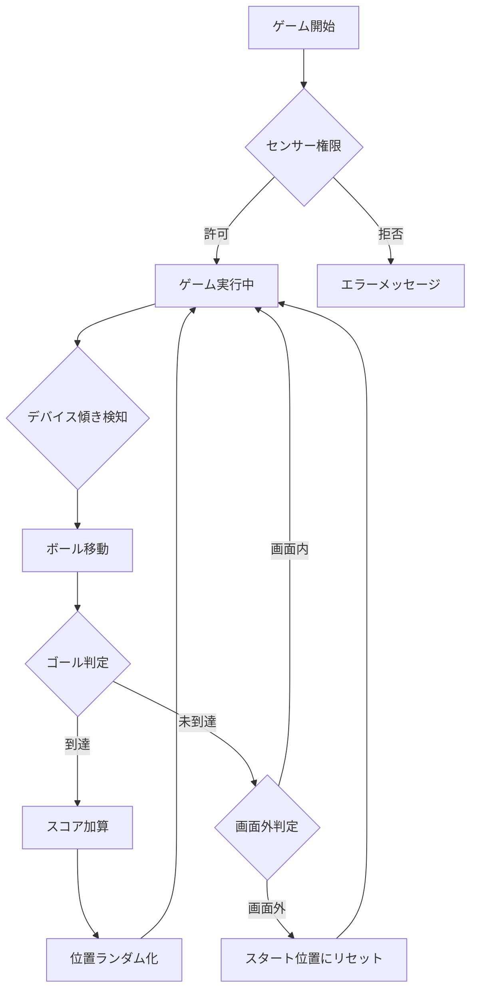

# 傾きセンサーゲーム

iPhoneの傾きセンサー（DeviceOrientation API）を使用して、丸いポイントをゴールまで移動させるPWAゲームです。

## 🎮 ゲームの説明

- デバイスを傾けて青いボールを動かします
- 緑色のゴールに到達すると得点が入ります
- ゴールするたびにスタート位置とゴールがランダムに再配置されます
- 画面外に移動してしまった場合は、元のスタート位置に戻ります

## 🚀 機能

- **傾きセンサー対応**: DeviceOrientation APIを使用
- **PWA対応**: オフラインで動作可能
- **レスポンシブデザイン**: スマートフォンに最適化
- **スコアシステム**: ゴール達成回数をカウント
- **ランダム配置**: 毎回異なる配置で飽きずに遊べる

## 📱 対応デバイス

- iPhone（iOS 13以降推奨）
- Android端末（ジャイロセンサー搭載）
- その他の傾きセンサー対応デバイス

## 🛠️ 技術スタック

- HTML5 Canvas
- JavaScript (Vanilla)
- CSS3
- Service Worker (PWA)
- DeviceOrientation API

## 📂 ファイル構成

```
PWA-motion/
├── index.html           # メインHTMLファイル
├── game.js             # ゲームロジック
├── style.css           # スタイルシート
├── manifest.json       # PWAマニフェスト
├── service-worker.js   # サービスワーカー
├── icon-192.png        # アイコン (192x192)
├── icon-512.png        # アイコン (512x512)
└── README.md           # このファイル
```

## 🎯 ゲームフロー



## 🌐 デプロイ

このプロジェクトはGitHub Pagesでホストされています。

### 自動デプロイ

GitHub Actionsを使用した自動デプロイが設定されています。`main`ブランチにコードがプッシュされると、自動的にGitHub Pagesにデプロイされます。

#### 初回セットアップ

1. GitHubリポジトリの **Settings** に移動
2. **Pages** セクションを選択
3. **Source** を "GitHub Actions" に設定
4. 設定を保存

#### デプロイURL

デプロイ後、以下のURLでアクセス可能になります：
`https://hn770123.github.io/PWA-motion/`

#### デプロイステータス確認

- リポジトリの **Actions** タブでデプロイの進行状況を確認できます
- デプロイは通常1〜2分程度で完了します

## 💻 ローカルでの実行

1. リポジトリをクローン:
   ```bash
   git clone https://github.com/hn770123/PWA-motion.git
   cd PWA-motion
   ```

2. ローカルサーバーを起動:
   ```bash
   # Python 3の場合
   python -m http.server 8000
   
   # Node.jsのhttp-serverを使用する場合
   npx http-server
   ```

3. ブラウザで開く:
   ```
   http://localhost:8000
   ```

**注意**: Service Workerを使用するため、HTTPSまたはlocalhostでの実行が必要です。

## 📝 使い方

1. ブラウザでゲームにアクセス
2. iOS 13以降の場合、「センサーを開始」ボタンをクリックして権限を許可
3. デバイスを傾けて青いボールを動かす
4. 緑色のゴールにボールを到達させる
5. スコアを競う！

## 🔧 カスタマイズ

`game.js`の定数を変更することで、ゲームの挙動を調整できます：

- `PLAYER_RADIUS`: プレイヤーの大きさ
- `GOAL_RADIUS`: ゴールの大きさ
- `FRICTION`: 摩擦係数（小さいほど滑りやすい）
- `TILT_SENSITIVITY`: 傾き感度（大きいほど敏感）

## 📄 ライセンス

MIT License

## 👤 作者

hn770123
